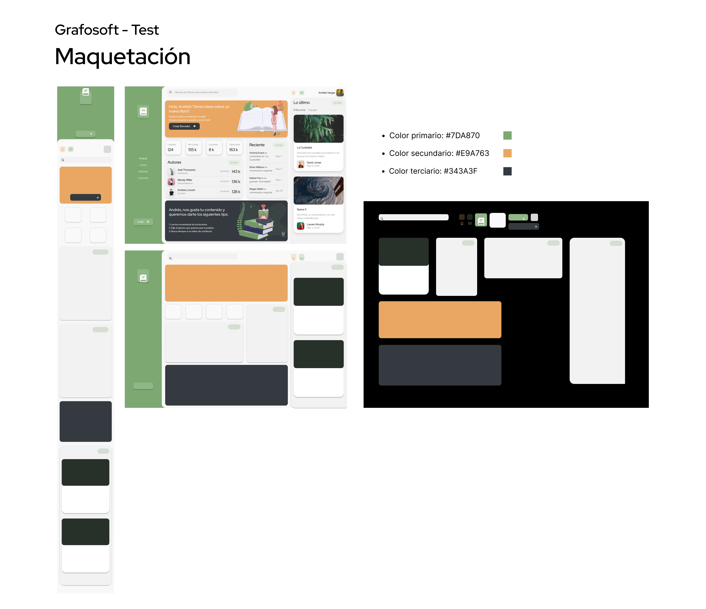

# GrafoSoft - Test

## Maquetacion


# ¿Como usar?
## Clonar el Repositorio

1. Clona el repositorio desde GitHub:

```bash
git clone <URL_del_repositorio>
```

2. Navega al directorio del proyecto:

```bash
cd <nombre_del_directorio>
```

## Instalar Dependencias

1. Instala las dependencias del proyecto:

```bash
npm install
# o
yarn
```

## Ejecutar el Servidor de Desarrollo

1. Inicia el servidor de desarrollo:

```bash
npm run dev
# o
yarn dev
```

2. Abre [http://localhost:3000](http://localhost:3000) en tu navegador para ver la aplicación en ejecución.

## Compilar el Proyecto

1. Para compilar el proyecto para producción:

```bash
npm run build
# o
yarn build
```
